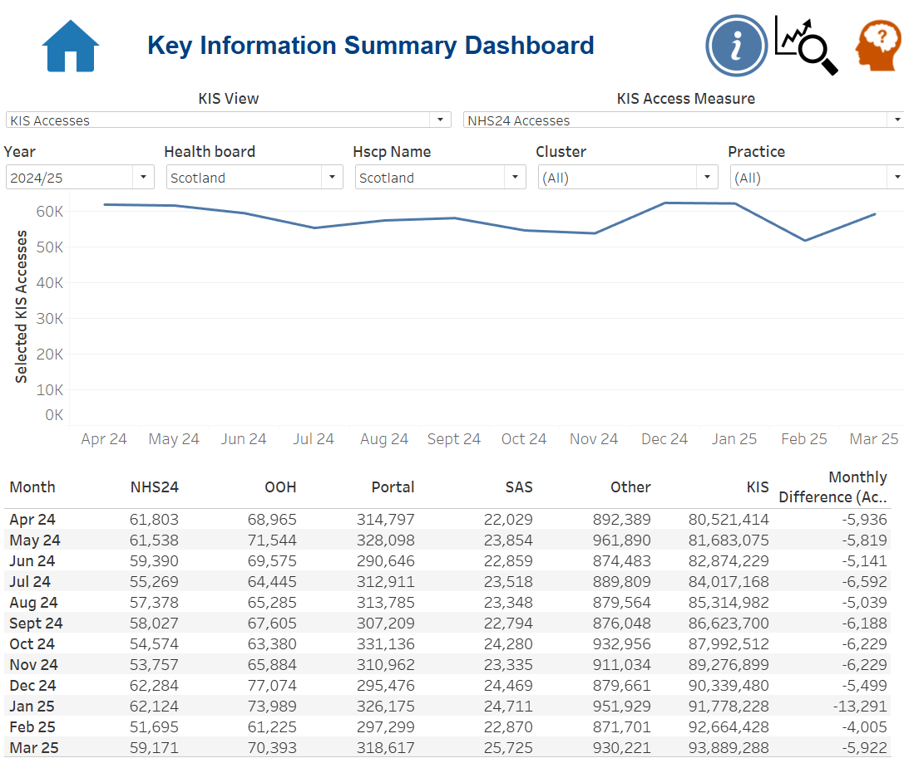
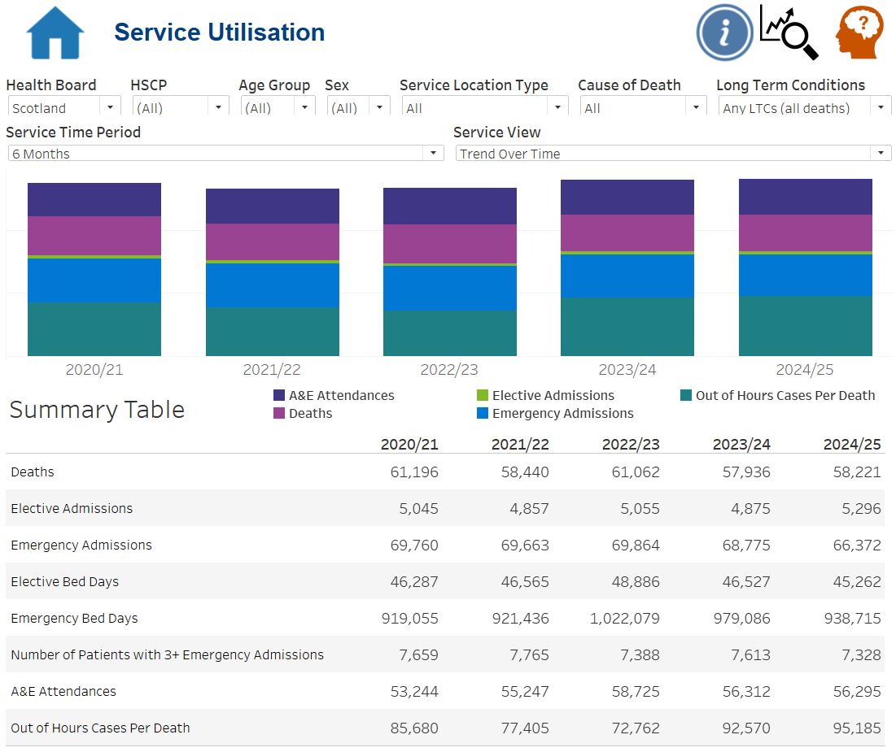
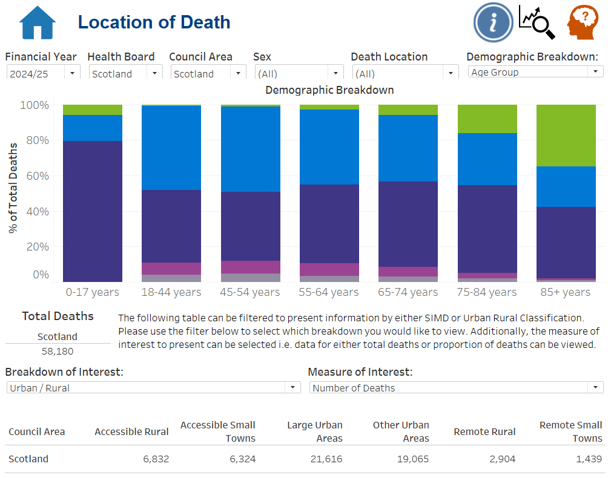

# Palliative & End-of-Life Care Tableau Reporting Suite

> **Portfolio status: Work in progress** — the first full technical case study is complete and the remaining dashboard areas are being added progressively over the coming weeks. This repository is intentionally being developed in layers so that each published section is accurate, evidence-led and safe for public viewing rather than rushed for completeness.

## Project overview

This repository documents a professional **Tableau reporting suite for palliative and end-of-life care analysis in Scotland**. The wider reporting solution brings together several related analytical areas within a consistent interactive reporting environment, helping users explore patterns in hospital activity, service use and end-of-life care at Scotland level.

The portfolio is designed for two audiences:

- **Recruiters and hiring managers** can use this homepage for a concise overview of the project, my contribution and the BI skills demonstrated.
- **Technical reviewers** can follow the links into individual dashboard case studies for methodology, Tableau implementation, calculated fields, parameters, worksheets, validation evidence and development history.

The production reporting environment uses linked health and death-record data. This public repository therefore focuses on **approved Scotland-level screenshots, reporting methodology and technical documentation** rather than publishing underlying datasets, operational code, workbook files or granular outputs.

## My contribution

My work on the reporting suite has centred on the **Tableau reporting and analytical delivery layer**, alongside contributing to the wider analytical workflow and quality-assurance process. This includes:

- developing and refining interactive Tableau dashboards and worksheets;
- creating and maintaining calculated fields, parameters, filters and reusable reporting logic;
- translating analytical requirements into accessible visual reporting;
- working with R- and SQL-supported analytical workflows and prepared reporting outputs;
- validating calculations, totals, filters and refreshed reporting data;
- responding to stakeholder feedback through iterative dashboard development;
- documenting definitions, caveats and interpretation guidance for users;
- working within public-health data governance, disclosure and confidentiality requirements.

The underlying analytical work is team-maintained, so the portfolio deliberately distinguishes my direct contribution from wider team ownership.

## Reporting-suite dashboard areas

The Tableau workbook contains five main analytical areas. The **Admissions Dashboard** is the first completed technical case study; the remaining sections will be added using the same evidence-led structure as their public-safe material is prepared.

| Dashboard area | Portfolio status | Current public evidence |
| --- | --- | --- |
| **Admissions Dashboard** | ✅ Full technical case study complete | Five pre-death time windows, two trend measures, parameter-driven reporting, Scotland comparator logic, QA and stakeholder-led development |
| **Last 6 Months of Life by Setting (MSG5)** | 🚧 Case study in progress | Scotland-level overview screenshot now published |
| **Key Information Summary** | 🚧 Case study in progress | Scotland-level overview screenshot now published |
| **Service Utilisation** | 🚧 Case study in progress | Scotland-level overview screenshot now published |
| **Location of Death** | 🚧 Case study in progress | Scotland-level overview screenshot now published |

The overview screenshots below give an immediate view of the wider reporting suite while the supporting technical documentation is developed dashboard by dashboard.

## Reporting suite — Scotland-level visual overview

### Admissions Dashboard

The Admissions Dashboard is the first fully documented technical case study and currently provides the deepest evidence of Tableau implementation, analytical design, QA and iterative stakeholder development.

### Last 6 Months of Life by Setting

This dashboard provides a Scotland-level view of activity across care settings during the final six months of life. The detailed case study will be added as the supporting methodology, calculations, controls and validation evidence are documented.

### Key Information Summary

This dashboard provides a high-level Scotland summary of key palliative and end-of-life care measures. The future case study will document the reporting logic, information design, analytical context and QA behind the view.

### Service Utilisation

This dashboard provides a Scotland-level overview of service-use patterns within the wider reporting suite. Detailed documentation covering interactions, measures, validation and analytical interpretation will follow.

### Location of Death

This dashboard provides a Scotland-level view of location-of-death reporting. The supporting case study will later document the underlying measures, visual design, filters, validation process and stakeholder reporting context.

## Completed case study — Admissions Dashboard

The Admissions Dashboard is currently the most complete evidence package in the repository and establishes the documentation standard for the wider suite.

It brings multiple pre-death hospital-admission analyses into one reusable Tableau interface, supporting:

- **7 days, 14 days, 3 months, 6 months and 12 months** before death;
- switching between **Admissions per Death** and **Average Length of Stay**;
- Scotland-level comparison and contextual reporting;
- demographic, admission, cause-of-death and geographic filtering within the governed production design;
- embedded definitions and selection guidance;
- repeatable calculation logic and validation across reporting periods.

The case study includes **10 approved Scotland-level dashboard states, 7 Tableau worksheets, 2 parameters and 19 calculated fields**, together with methodology, implementation, validation and development documentation.

### Explore the Admissions evidence

- [Admissions Dashboard — Technical Case Study](dashboards/admissions/README.md)
- [Dashboard screenshots](dashboards/admissions/dashboard-screenshots/README.md)
- [Data pipeline and methodology](dashboards/admissions/data-pipeline-and-methodology.md)
- [Tableau implementation](dashboards/admissions/tableau-implementation.md)
- [Validation and development](dashboards/admissions/validation-and-development.md)
- [Parameters](dashboards/admissions/parameters/README.md)
- [Calculated fields](dashboards/admissions/calculated-fields/README.md)
- [Worksheets](dashboards/admissions/worksheets/README.md)

## Technical and professional capability demonstrated

This portfolio is intended to evidence more than chart creation. Across the reporting suite it demonstrates:

- **Tableau:** dashboard composition, calculations, parameters, filters, interaction design and user guidance;
- **Business intelligence:** translating reporting questions into structured, maintainable analytical products;
- **R and SQL:** experience within the wider preparation, analytical and validation workflow;
- **data quality:** reconciliation, QA, refresh checking and interpretation controls;
- **stakeholder engagement:** iterative development informed by regular review and feedback;
- **data visualisation:** clarity, consistency, hierarchy, usability and accessible explanation of complex measures;
- **governance:** working safely with sensitive public-health information and publishing only approved aggregate evidence;
- **documentation:** recording methodology, calculation logic, development decisions and limitations so the work can be understood and maintained.

## Development approach

The repository is being built **dashboard by dashboard**, using the same core structure where appropriate:

1. reporting problem and intended users;
2. my contribution and ownership boundary;
3. analytical/data pipeline;
4. Tableau implementation and interactions;
5. calculations, parameters and worksheets;
6. validation and quality assurance;
7. stakeholder-led iteration and development history;
8. governance and public-safety boundary;
9. reporting value and employer-relevant skills;
10. approved visual evidence.

This approach means the repository can remain publicly useful while the wider suite is still being documented, without presenting unfinished technical sections as complete.

## Public portfolio and governance boundary

The production reporting solution uses linked health and death-record information. To protect confidentiality and organisational ownership:

- no patient-level or granular source data is published;
- no Tableau workbook or extracts are distributed;
- no operational R or SQL code containing internal logic or paths is published;
- screenshots are restricted to approved **Scotland-level aggregated views**;
- methodology is described at a level that demonstrates analytical and BI capability without exposing restricted information;
- shared/team-owned analytical work is not presented as solely my own.

The repository should therefore be read as **evidence of professional BI delivery, reporting design, analytical reasoning, QA and stakeholder-led development**, not as a public release of the underlying management-information system.

## Current roadmap

- [x] Create the public Tableau reporting-suite repository.
- [x] Complete the Admissions Dashboard technical case study.
- [x] Publish Admissions Scotland-level visual evidence and technical documentation.
- [x] Add a representative Scotland-level screenshot for each remaining dashboard area.
- [ ] Build the Last 6 Months of Life by Setting case study.
- [ ] Build the Key Information Summary case study.
- [ ] Build the Service Utilisation case study.
- [ ] Build the Location of Death case study.
- [ ] Complete a final suite-wide consistency, accuracy and governance review.
- [ ] Add an employer-facing walkthrough once the written evidence package is mature.

---

**Built as an employer-facing portfolio of professional Tableau / BI delivery, with the repository continuing to expand as the remaining dashboard evidence is prepared.**