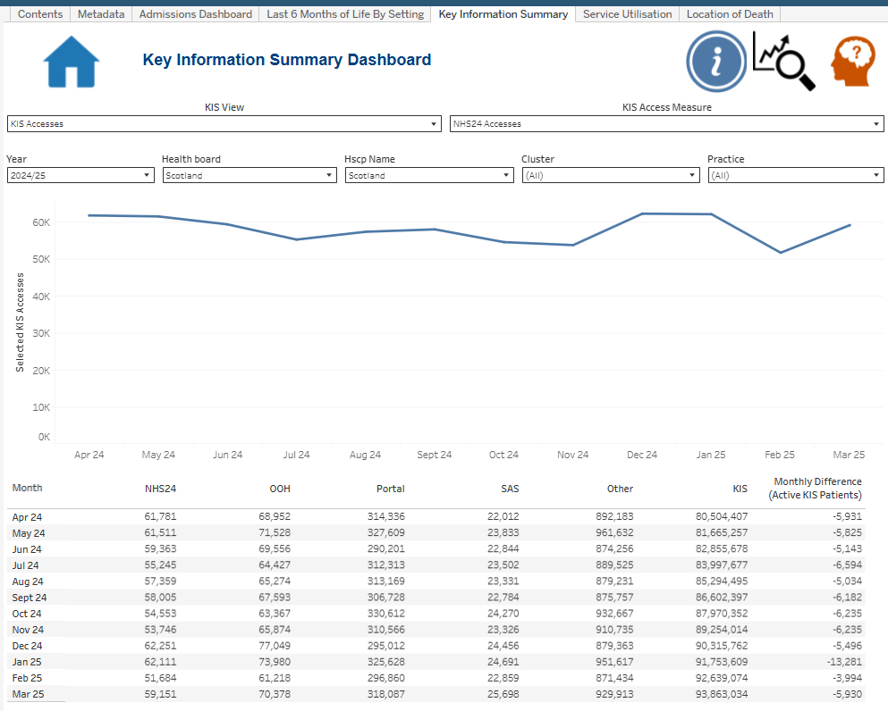

# Palliative & End-of-Life Care Tableau Reporting Suite

> **Portfolio status:** two complete technical case studies — **Admissions Dashboard** and **Last 6 Months of Life by Setting (MSG5)** — with **Key Information Summary (KIS)** now in final recruiter-style QA and the remaining Service Utilisation / Location of Death frameworks ready for evidence.

## Project overview

This repository documents a professional **Tableau reporting suite for palliative and end-of-life care analysis in Scotland**. The wider reporting solution brings together several related analytical areas within a consistent interactive reporting environment, helping users explore patterns in hospital activity, service use and end-of-life care at Scotland level.

The portfolio is designed for two audiences:

- **Recruiters and hiring managers** can use this homepage for a concise overview of the project, my contribution and the BI skills demonstrated.
- **Technical reviewers** can follow the links into individual dashboard case studies for methodology, Tableau implementation, calculated fields, parameters, worksheets, validation evidence and development history.

The production reporting environment uses linked health and death-record data. This public repository therefore focuses on **approved Scotland-level analytical screenshots, reporting methodology and technical documentation** rather than publishing underlying datasets, operational code, workbook files or granular outputs.

## My contribution

My work on the reporting suite has centred on the **Tableau reporting and analytical delivery layer**, alongside contributing to the wider analytical workflow and quality-assurance process. This includes:

- developing and refining interactive Tableau dashboards and worksheets;
- creating and maintaining calculated fields, parameters, filters and reusable reporting logic;
- translating analytical requirements into accessible visual reporting;
- working with R- and SQL-supported analytical workflows and prepared reporting outputs;
- validating calculations, totals, filters and refreshed reporting data;
- responding to stakeholder feedback through iterative dashboard development;
- documenting definitions, caveats and interpretation guidance for users;
- working within public-health data governance, disclosure and confidentiality requirements.

The underlying analytical work is team-maintained, so the portfolio deliberately distinguishes my direct contribution from wider team ownership.

## Reporting-suite dashboard areas

The Tableau workbook contains five main analytical areas. **Admissions** and **MSG5** are complete technical case studies. **KIS** has its full written evidence package and screenshots in place and is undergoing the final recruiter-style visual consistency check before being marked complete.

| Dashboard area | Portfolio status | Current public evidence |
| --- | --- | --- |
| **Admissions Dashboard** | ✅ Full technical case study complete | Five pre-death time windows, two trend measures, parameter-driven reporting, Scotland comparator logic, QA and stakeholder-led development |
| **Last 6 Months of Life by Setting (MSG5)** | ✅ Full technical case study complete | Scotland Numbers/Percentages states, two parameters, four analytical worksheets, four relevant calculated/helper fields, Information/navigation evidence, methodology and QA |
| **Key Information Summary** | 🟡 Final recruiter QA | Combined Accesses/Patients dashboard, full-join R/data QA history, KIS View and Access Measure controls, three analytical worksheets, five calculated/helper fields and Scotland-level evidence |
| **Service Utilisation** | 🧱 Case-study framework created | Scotland-level overview plus matching README/methodology/implementation/validation/evidence folders ready for Tableau evidence |
| **Location of Death** | 🧱 Case-study framework created | Scotland-level overview plus matching README/methodology/implementation/validation/evidence folders ready for Tableau evidence |

## Reporting suite — Scotland-level visual overview

### Admissions Dashboard

The Admissions Dashboard provides the deepest evidence of parameter-driven analytical interaction, time-window logic, comparator calculations, QA and iterative stakeholder development.

### Last 6 Months of Life by Setting

MSG5 translates a governed end-of-life indicator into a compact Tableau interface where users can move between absolute bed-day totals and proportional distributions across four care settings.

### Key Information Summary

KIS combines what began as separate Accesses and Patients products into one parameter-driven Tableau dashboard. The technical case study also documents the combined-source full join, duplicate-key QA, source-total reconciliation and the correction that removed duplicate lookup inflation before the final Tableau source was signed off.

[Open the KIS technical case study](dashboards/key-information-summary/README.md)

### Service Utilisation

This dashboard provides a Scotland-level overview of service-use patterns within the wider reporting suite. Its case-study framework is in place and will be populated with the real worksheets, controls, measures, validation and interpretation evidence.

### Location of Death

This dashboard provides a Scotland-level view of location-of-death reporting. Its case-study framework is in place and will be completed using the actual measures, visual design, filters/controls, validation process and stakeholder-development evidence.

## Completed case study — Admissions Dashboard

The Admissions Dashboard brings multiple pre-death hospital-admission analyses into one reusable Tableau interface, supporting:

- **7 days, 14 days, 3 months, 6 months and 12 months** before death;
- switching between **Admissions per Death** and **Average Length of Stay**;
- Scotland-level comparison and contextual reporting;
- demographic, admission, cause-of-death and geographic filtering within the governed production design;
- embedded definitions and selection guidance;
- repeatable calculation logic and validation across reporting periods.

The case study includes **10 approved Scotland-level dashboard states, 7 Tableau worksheets, 2 parameters and 19 calculated fields**, together with methodology, implementation, validation and development documentation.

### Explore the Admissions evidence

- [Admissions Dashboard — Technical Case Study](dashboards/admissions/README.md)
- [Dashboard screenshots](dashboards/admissions/dashboard-screenshots/README.md)
- [Data pipeline and methodology](dashboards/admissions/data-pipeline-and-methodology.md)
- [Tableau implementation](dashboards/admissions/tableau-implementation.md)
- [Validation and development](dashboards/admissions/validation-and-development.md)
- [Parameters](dashboards/admissions/parameters/README.md)
- [Calculated fields](dashboards/admissions/calculated-fields/README.md)
- [Worksheets](dashboards/admissions/worksheets/README.md)

## Completed case study — Last 6 Months of Life by Setting (MSG5)

MSG5 demonstrates a different BI problem from Admissions: a substantial indicator is calculated upstream by another team, while the Tableau layer needs to present that governed output clearly, accurately and with an explicit ownership boundary.

The completed case study demonstrates:

- a **Bed Days** parameter switching between **Numbers** and **Percentages**;
- a **Council Area** parameter with supporting Tableau selection logic;
- paired stacked-bar and detailed-table worksheets for the two display states;
- direct use of source-supplied bed-day and percentage measures;
- lightweight calculated/helper fields for geography selection, view switching and display formatting;
- tooltip context using Deaths and Possible Bed days;
- embedded Information, Home, Help and Go To components;
- source-to-dashboard reconciliation and denominator reasonableness checks;
- clear attribution of upstream MSG Indicator 5 methodology versus my Tableau reporting contribution.

### Explore the MSG5 evidence

- [MSG5 — Technical Case Study](dashboards/last-six-months-of-life-msg5/README.md)
- [Dashboard screenshots](dashboards/last-six-months-of-life-msg5/dashboard-screenshots/README.md)
- [Data pipeline and methodology](dashboards/last-six-months-of-life-msg5/data-pipeline-and-methodology.md)
- [Tableau implementation](dashboards/last-six-months-of-life-msg5/tableau-implementation.md)
- [Validation and development](dashboards/last-six-months-of-life-msg5/validation-and-development.md)
- [Parameters](dashboards/last-six-months-of-life-msg5/parameters/README.md)
- [Calculated fields](dashboards/last-six-months-of-life-msg5/calculated-fields/README.md)
- [Worksheets](dashboards/last-six-months-of-life-msg5/worksheets/README.md)

## Technical and professional capability demonstrated

This portfolio is intended to evidence more than chart creation. Across the reporting suite it demonstrates:

- **Tableau:** dashboard composition, calculations, parameters, filters, interaction design and user guidance;
- **Business intelligence:** translating reporting questions into structured, maintainable analytical products;
- **R and SQL:** experience within the wider preparation, analytical and validation workflow;
- **data integration and QA:** join-grain reasoning, duplicate-key checks, reconciliation, refresh checking and interpretation controls;
- **stakeholder engagement:** iterative development informed by regular review and feedback;
- **data visualisation:** clarity, consistency, hierarchy, usability and accessible explanation of complex measures;
- **governance:** working safely with sensitive public-health information and publishing only approved aggregate evidence;
- **documentation:** recording methodology, calculation logic, development decisions and limitations so the work can be understood and maintained.

## Development approach

The repository is being built **dashboard by dashboard**, using the same core structure where appropriate:

1. reporting problem and intended users;
2. my contribution and ownership boundary;
3. analytical/data pipeline;
4. Tableau implementation and interactions;
5. calculations, parameters and worksheets;
6. validation and quality assurance;
7. stakeholder-led iteration and development history;
8. governance and public-safety boundary;
9. reporting value and employer-relevant skills;
10. approved visual evidence.

The common structure is a framework, not a requirement to manufacture identical complexity. A dashboard with a small calculation or parameter layer is documented proportionately rather than padded simply to match Admissions.

## Public portfolio and governance boundary

The production reporting solution uses linked health and death-record information. To protect confidentiality and organisational ownership:

- no patient-level or granular source data is published;
- no Tableau workbook or extracts are distributed;
- no operational R or SQL code containing internal logic or paths is published;
- analytical dashboard screenshots are restricted to approved **Scotland-level aggregated views**;
- parameter, calculated-field and worksheet screenshots are included only to demonstrate technical configuration and do not publish local analytical results;
- methodology is described at a level that demonstrates analytical and BI capability without exposing restricted information;
- shared/team-owned analytical work is not presented as solely my own.

The repository should therefore be read as **evidence of professional BI delivery, reporting design, analytical reasoning, QA and stakeholder-led development**, not as a public release of the underlying management-information system.

## Current roadmap

- [x] Create the public Tableau reporting-suite repository.
- [x] Complete the Admissions Dashboard technical case study.
- [x] Publish Admissions Scotland-level visual evidence and technical documentation.
- [x] Add a representative Scotland-level screenshot for each remaining dashboard area.
- [x] Create the common case-study framework for MSG5, Key Information Summary, Service Utilisation and Location of Death.
- [x] Complete the MSG5 technical case study, evidence upload and final consistency/governance review.
- [ ] Complete final recruiter QA and sign off the Key Information Summary case study.
- [ ] Complete the Service Utilisation case study from its live Tableau evidence.
- [ ] Complete the Location of Death case study from its live Tableau evidence.
- [ ] Complete a final suite-wide consistency, accuracy and governance review.
- [ ] Add an employer-facing walkthrough once the written evidence package is mature.

---

**Built as an employer-facing portfolio of professional Tableau / BI delivery, with a consistent evidence framework across the suite and dashboard-specific detail added only where supported by the real implementation.**