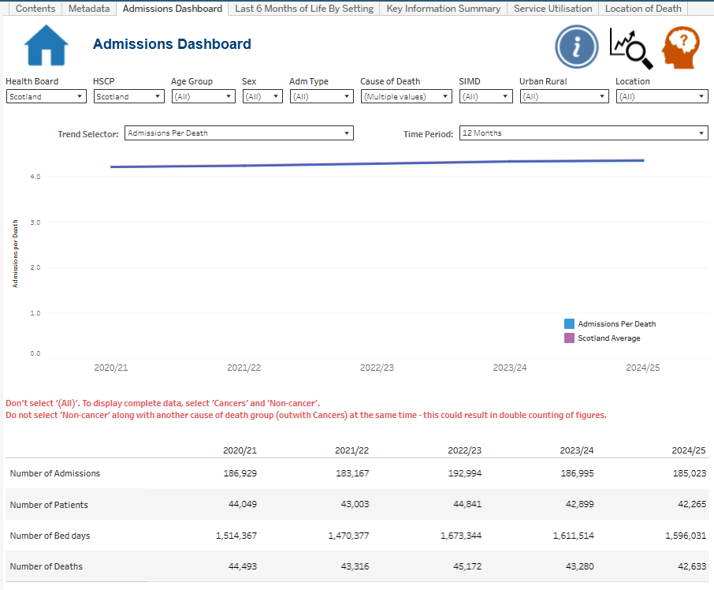

# Admissions Dashboard — Technical Case Study



This case study documents the development of the **Admissions Dashboard** within a wider palliative and end-of-life care Tableau reporting suite. It is designed as the second layer of the portfolio: the repository homepage will provide the concise employer-facing overview, while this section shows the analytical methodology, Tableau implementation, validation evidence and development history in more depth.

## Reporting problem

Existing admissions analysis was produced across separate pre-death time-period outputs. The Tableau solution brings this related analysis into one interactive reporting interface so users can move between multiple analytical windows and measures without navigating separate outputs.

The dashboard supports five selectable periods before death:

- **7 days**
- **14 days**
- **3 months**
- **6 months**
- **12 months**

The reporting layer combines trend analysis, a Scotland comparator, a detailed yearly summary table and user-controlled demographic, admission, cause-of-death and geographic filters.

## My contribution

The upstream R analysis is a **team-maintained analytical pipeline**. My contribution included working with the prepared analytical outputs and contributing to ongoing analytical development, while my primary responsibility was the **Tableau reporting layer**: building and refining the dashboard, worksheets, calculated fields, parameters, filters, information design, navigation and QA checks.

This distinction is intentional. The case study documents the work I can evidence directly without presenting shared analytical code as solely my own work.

## What the dashboard measures

The dashboard reports four core activity measures across the selected time window:

| Measure | Interpretation |
| --- | --- |
| **Admissions** | Admission events; an individual can contribute more than one admission. |
| **Patients** | Unique individuals admitted within the selected analytical period. |
| **Bed days** | Hospital time occurring within the selected period before death. |
| **Deaths** | The relevant death cohort used to contextualise activity. |

The main trend can then be switched between **Admissions per Death** and **Average Length of Stay** using the Trend Selector parameter.

### Admissions per Death

```text
Selected Admissions / Selected Deaths
```

A zero-denominator check returns null when Selected Deaths is zero.

### Average Length of Stay

```text
Selected Beddays / Selected Patients
```

A zero-denominator check returns null when Selected Patients is zero.

Both calculations use parameter-selected activity fields, so the same logic automatically follows the active 7-day, 14-day, 3-month, 6-month or 12-month window.

## Why the 7-day view exists

The reporting originally focused on longer pre-death periods. During a clinical stakeholder review in **May 2026**, a palliative-medicine stakeholder asked whether the analysis could also support the final **7 days of life**. The analytical pipeline was extended and the Tableau Time Window control was updated so the additional period could be explored in the same reporting interface.

This is an example of the iterative development approach used throughout the project: feedback from review sessions was translated into a concrete analytical and reporting enhancement rather than requiring a separate dashboard.

## Analytical architecture

```text
Linked death and hospital activity data
        ↓
R-based analytical preparation and validation
        ↓
7d | 14d | 3m | 6m | 12m activity measures
        ↓
Aggregated Tableau-ready dataset
        ↓
Time Window parameter + reusable calculations
        ↓
Trend Selector + Scotland comparator logic
        ↓
Interactive Tableau dashboard
        ↓
QA, stakeholder review and iterative refinement
```

The detailed methodology, including how admissions, patients and bed days are constructed for each time window, is documented in [Data Pipeline and Methodology](data-pipeline-and-methodology.md).

## Tableau implementation

The dashboard uses two parameters as the centre of its reusable calculation architecture:

- **Time Window** — selects 7 Days, 14 Days, 3 Months, 6 Months or 12 Months.
- **Trend Selector** — switches the main trend between Admissions Per Death and Average Length of Stay.

These work with reusable calculated fields for selected admissions, patients, bed days and deaths; Scotland comparator calculations; filter logic; and dedicated analytical and interface worksheets.

See [Tableau Implementation](tableau-implementation.md), [Parameters](parameters/README.md) and [Calculated Fields](calculated-fields/README.md).

## Cause-of-death selection design

The source analysis contains individual cause-of-death groups and an additional aggregated **Non-cancer** category. Because Non-cancer represents the combined non-cancer groups, selecting it together with one of its component non-cancer categories would duplicate activity in the displayed result.

The dashboard therefore provides explicit guidance:

- use **Cancers + Non-cancer** to represent the complete cancer/non-cancer split;
- do not combine **Non-cancer** with an individual non-cancer cause group.

This is treated as an interpretation and data-quality control rather than left for users to discover through incorrect totals.

## Validation and review

The dashboard has been refined through **fortnightly Palliative and End-of-Life Care review meetings**, where the team discusses data refreshes, completeness, current analytical work, reporting requirements and potential improvements.

Validation goes beyond checking whether the charts render correctly. For the established **14-day, 3-month, 6-month and 12-month** periods, Tableau and analytical outputs were reconciled against the corresponding annual **Number of Admissions** publication outputs. The later 7-day enhancement was checked against the prepared analytical dataset and the same reusable calculation framework.

Checks include totals, parameters, filter behaviour, Scotland comparator values, summary-table alignment and both derived trend measures.

See [Validation and Development](validation-and-development.md) for the development timeline and QA approach.

## Evidence in this case study

The Admissions section now contains:

- **10 approved Scotland-level dashboard states** covering all five time windows and both trend measures;
- **7 Tableau worksheets** showing the analytical and interface components used to assemble the dashboard;
- **2 parameters**;
- **19 calculated fields**, grouped by analytical purpose;
- methodology documentation describing the upstream analytical pipeline without publishing the operational R code or underlying source records;
- validation and development history showing how numerical checks and stakeholder feedback informed the finished solution.

Explore the full evidence set through:

- [Dashboard screenshots](dashboard-screenshots/README.md)
- [Worksheets](worksheets/README.md)
- [Parameters](parameters/README.md)
- [Calculated fields](calculated-fields/README.md)
- [Validation and development](validation-and-development.md)

## Portfolio and governance boundary

The production analysis uses linked health and death-record data and therefore the underlying datasets and operational R code are **not published in this repository**. Public portfolio screenshots are restricted to approved Scotland-level views and are used to demonstrate reporting design, technical implementation and analytical breadth without exposing granular records.

The repository should therefore be read as **evidence of the BI solution and methodology**, not as a public release of the underlying management-information data.
