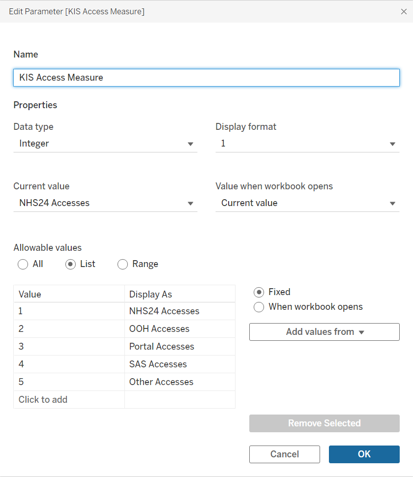
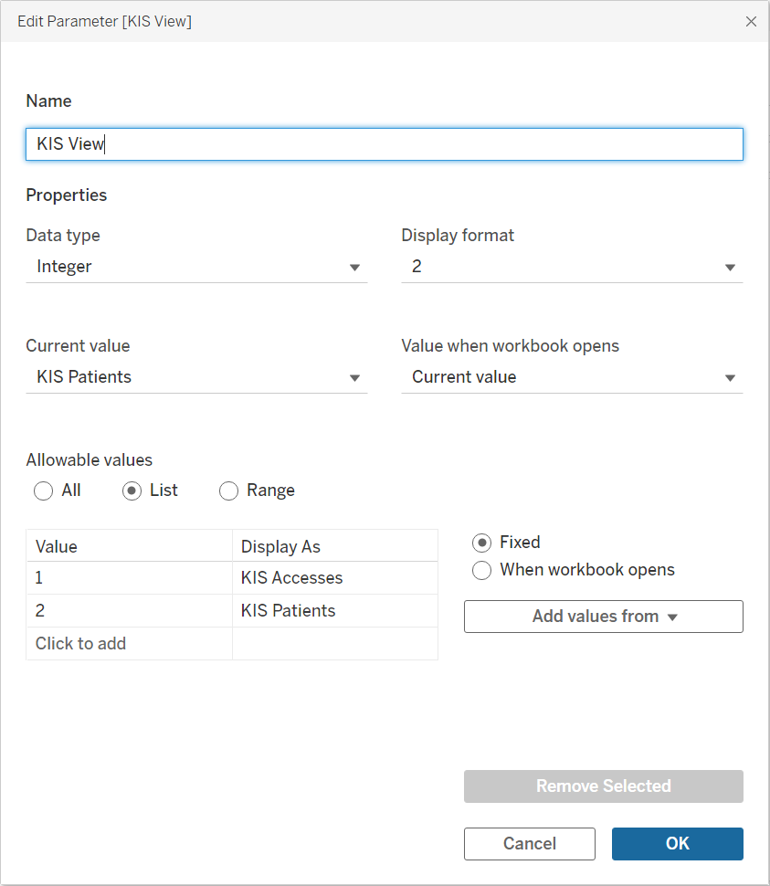
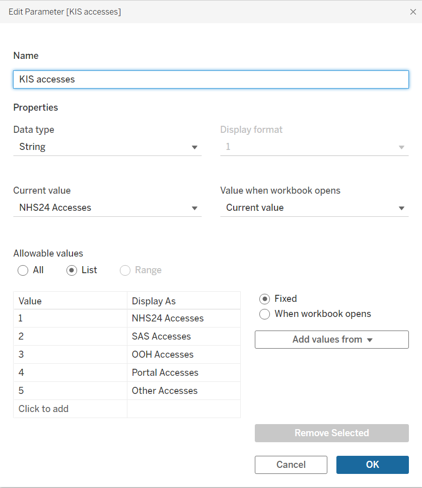

# Key Information Summary — Parameters and User Controls

The supplied workbook contains three KIS-related parameter configurations. Two are core controls in the final delivered dashboard; one is retained workbook configuration that is not treated as part of the final analytical interaction unless later evidence shows an active dependency.

## Parameter inventory

| Parameter | Data type | Role in final implementation | Evidence |
| --- | --- | --- | --- |
| **KIS Access Measure** | Integer list | Core Accesses control — selects which access channel is plotted | `01-KIS-Access-Measure.png` |
| **KIS accesses** | String list | Retained / legacy parameter mirroring access categories | `02-KIS-accesses.png` |
| **KIS View** | Integer list | Core dashboard control — switches KIS Accesses / KIS Patients | `03-KIS-View.png` |

## KIS Access Measure



This is the active selector used by the Access trend.

| Stored value | Display as |
| ---: | --- |
| `1` | NHS24 Accesses |
| `2` | OOH Accesses |
| `3` | Portal Accesses |
| `4` | SAS Accesses |
| `5` | Other Accesses |

The supplied evidence shows **NHS24 Accesses** as the current value.

### Dependency

The parameter is consumed by the `Selected KIS Accesses` calculated field:

```text
KIS Access Measure
        ↓
Selected KIS Accesses
        ↓
KIS - Access Trend
```

This allows one worksheet to support five analytical measures.

## KIS View



This is the main combined-dashboard selector.

| Stored value | Display as |
| ---: | --- |
| `1` | KIS Accesses |
| `2` | KIS Patients |

The supplied parameter screenshot shows **KIS Patients** as the current value at capture time.

### Dependency

The parameter feeds the `KIS View Filter` helper used on the analytical worksheets:

```text
KIS View
    ↓
KIS View Filter
    ↓
Accesses or Patients analytical state
```

This is the control that made it possible to replace the earlier separate KIS dashboard pages with one combined reporting interface.

## `KIS accesses` retained parameter



The workbook also contains a string parameter named **KIS accesses** with five display values corresponding to the same access channels.

The supplied final worksheet and calculation evidence shows the delivered Access trend using **KIS Access Measure** rather than this parameter. It is therefore documented as a retained or superseded workbook artefact rather than counted as another active control.

That distinction is intentional: a technical portfolio should document **what actually drives the delivered product**, not inflate complexity by treating every object left in a workbook as production logic.

## Standard Tableau filters

In addition to parameters, the final KIS analytical views use standard filters for:

- Financial Year
- Health Board
- HSCP
- Cluster
- Practice

These filters provide the shared reporting context while the parameters control **which analytical view** and **which access measure** is displayed.

## Public evidence boundary

The parameter screenshots are safe technical evidence because they show configuration rather than granular analytical results. Local-level filter selections are not published in the public dashboard screenshot set.
