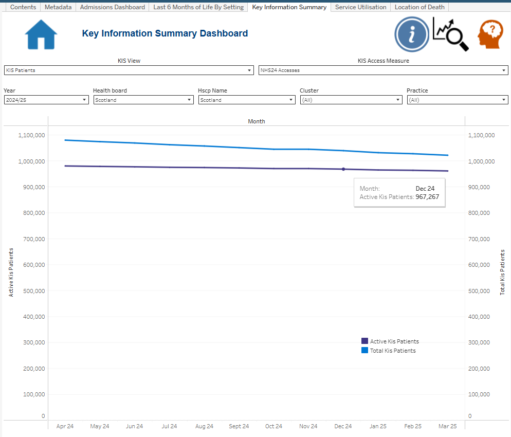
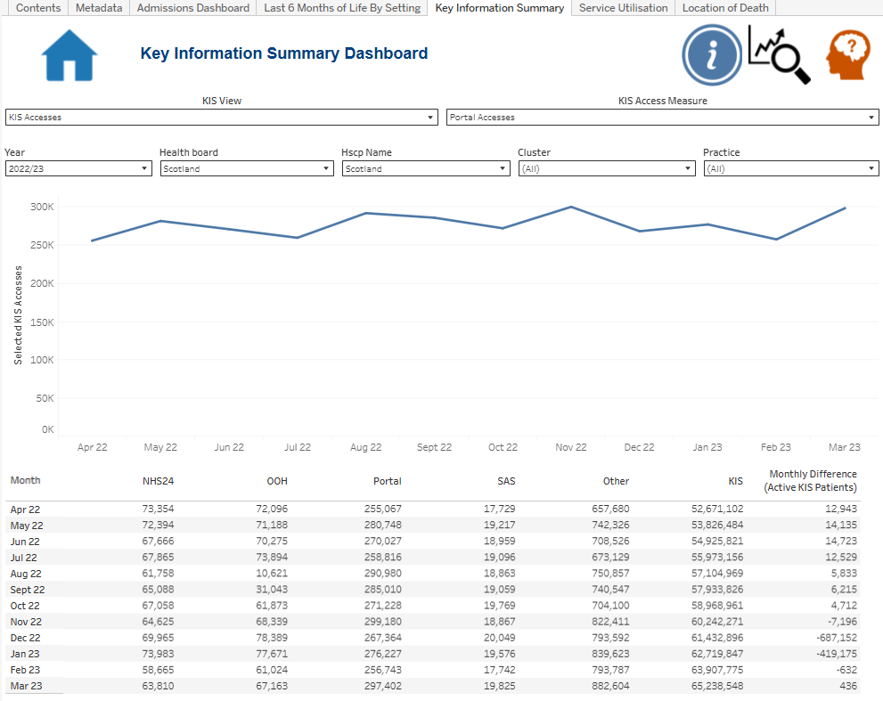
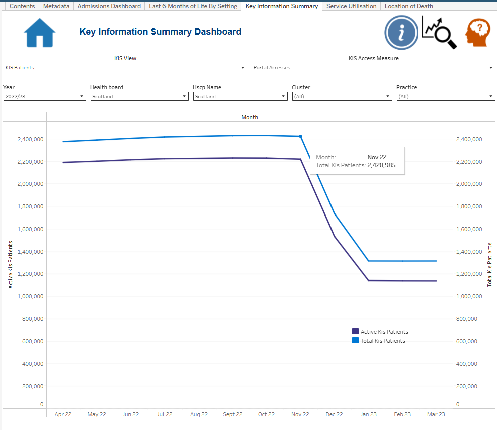

# Key Information Summary — Tableau Implementation

This page documents how the combined **Key Information Summary (KIS)** analytical output is implemented in Tableau.

The main design decision is to use **one dashboard page for two related analytical states** rather than maintain separate KIS Accesses and KIS Patients dashboards.

## Final dashboard architecture

```text
KIS View parameter
        ↓
KIS View Filter
        ↓
┌────────────────────────┬─────────────────────────┐
│ KIS Accesses           │ KIS Patients            │
│                        │                         │
│ KIS Access Trend       │ KIS Patients Trend      │
│ KIS Access Table       │                         │
│ KIS Access Measure     │                         │
└────────────────────────┴─────────────────────────┘
        ↓
shared Year / Health Board / HSCP / Cluster / Practice controls
        ↓
shared HOME / GO TO / HELP / INFO interface
```

The combined design allows the reporting context to remain consistent while the analytical focus changes.

## Data source used in Tableau

The supplied workbook evidence shows the combined source as **`KIS Combined_v2`**.

The name is a Tableau/workbook data-source label. The team has confirmed that the current workbook is using the **latest corrected combined KIS output**, including the duplicate-removal and QA corrections documented in [Validation and Development](validation-and-development.md).

## Core user controls

### 1. KIS View

The main dashboard selector switches between:

- KIS Accesses
- KIS Patients

The parameter is integer-backed:

| Value | Display |
| ---: | --- |
| 1 | KIS Accesses |
| 2 | KIS Patients |

The supporting `KIS View Filter` calculation is placed on the relevant analytical worksheets so the dashboard can coordinate the selected state without maintaining two separate dashboard tabs.

### 2. KIS Access Measure

When **KIS Accesses** is active, the second parameter controls the main Access trend:

| Value | Display |
| ---: | --- |
| 1 | NHS24 Accesses |
| 2 | OOH Accesses |
| 3 | Portal Accesses |
| 4 | SAS Accesses |
| 5 | Other Accesses |

The calculation `Selected KIS Accesses` maps the parameter choice to the appropriate source measure.

### 3. Shared filters

The analytical worksheets use a consistent filter set:

- Year / Financial Year
- Health Board
- HSCP
- Cluster
- Practice

The worksheet screenshots confirm these filters are applied across the Access and Patients analytical views so the two states can be compared within the same reporting context.

## Analytical worksheets

### KIS - Access Trend

**Purpose:** show the selected access channel over the months of the chosen financial year.

The supplied worksheet evidence shows:

```text
Columns: Month
Rows: AGG(Selected KIS Accesses)
Filters: KIS View Filter, Year, Health Board, HSCP, Cluster, Practice
Control: KIS Access Measure
Mark type: Line
```

This worksheet is intentionally reusable: the chart does not require a separate sheet for NHS24, OOH, Portal, SAS and Other. The parameter/calculation pair changes the measure displayed on the same line-chart structure.

### KIS - Access Table

**Purpose:** retain the wider monthly access breakdown even when the line chart is focused on one selected channel.

The supplied worksheet evidence shows:

```text
Columns: Measure Names
Rows: Month
Marks: Measure Values
Filters: KIS View Filter, Measure Names, Year, Health Board, HSCP, Cluster, Practice
```

The table contains the main access-channel measures, KIS activity and monthly-difference context. Some user-facing table headings use deliberately shorter **aliases** so the final table remains readable at dashboard size; the underlying technical fields are documented in the worksheet and calculated-field evidence.

This creates a useful two-level interaction: the line chart answers "how is the selected channel changing?" while the table keeps the rest of the monthly KIS activity visible for context.

### KIS Patients Trend

**Purpose:** compare Active KIS Patients with Total KIS Patients over time.

The worksheet evidence shows:

```text
Columns: Month
Rows: SUM(Active KIS Patients) + SUM(Total KIS Patients)
Filters: KIS View Filter, Practice, Health Board, Year, Cluster, HSCP
Mark type: Line
```

The chart uses two related patient measures in one monthly trend view, allowing the user to see the active cohort in the context of the wider KIS patient total.

## Date handling

The prepared source stores reporting time as a month/year text field. The `Month` calculated field converts that text into a real Tableau date so the monthly axes sort chronologically rather than alphabetically.

The calculation builds the year from the text suffix and maps the month abbreviation to a month number before creating a date value.

This is a small helper field but an important reporting-quality detail: a correctly typed date field makes the time-series behaviour predictable across financial years.

## Calculation architecture

### Selected KIS Accesses

The main access selector uses a CASE expression over `KIS Access Measure`:

```text
1 → NHS24 Accesses
2 → OOH Accesses
3 → Portal Accesses
4 → SAS Accesses
5 → Other Accesses
```

Each branch returns the sum of the corresponding prepared source measure.

### KIS View Filter

This helper returns the selected `KIS View` value and is used in worksheet filters to coordinate the Accesses / Patients dashboard state.

### Monthly Difference wrappers

The workbook contains separate readable calculated-field names for the Access and Patient monthly-difference context. These are thin wrappers around the suffixed source fields created when the two datasets were combined.

The public documentation focuses on their purpose rather than exposing internal suffix mechanics, because the important reporting distinction is **Access monthly change versus Patient monthly change**.

See [Calculated Fields](calculated-fields/README.md).

## Parameters retained in the workbook

Three parameter screenshots were supplied:

1. `KIS Access Measure` — core delivered Access selector.
2. `KIS accesses` — retained string parameter with the same five access categories.
3. `KIS View` — core Accesses / Patients selector.

The supplied final analytical worksheet evidence uses **KIS Access Measure**, not the second `KIS accesses` parameter, to drive the Access trend. The second parameter is therefore documented as retained/legacy configuration rather than counted as a second active access selector.

This is intentional: technical documentation should distinguish the final interaction architecture from unused or superseded workbook artefacts.

## Information and navigation design

The KIS dashboard uses four shared interface worksheets:

- **HOME** — returns to the reporting-suite landing/contents context.
- **GO TO** — supports suite navigation.
- **HELP** — exposes help guidance.
- **INFO** — provides KIS-specific definitions and interpretation guidance.

The Information view provides contextual guidance around the two KIS states, access channels, patient measures, filter structure and dashboard use. Its wording is part of the managed reporting product and can continue to evolve during team/publication review without changing the underlying technical architecture documented here.

## Dashboard states evidenced

The final public-safe evidence set contains four current Scotland-level states:

### KIS Accesses — 2024/25


### KIS Patients — 2024/25



### KIS Accesses — 2022/23 Portal



### KIS Patients — 2022/23



The paired 2022/23 screenshots are particularly useful because they demonstrate that the **KIS View parameter changes the analytical content while retaining the broader dashboard context**, while the Accesses screenshot also demonstrates a different selected access measure.

## Why the implementation is useful

The Tableau architecture avoids unnecessary duplication:

- one Access trend sheet replaces five separate channel-specific trend sheets;
- one KIS View control replaces separate Accesses and Patients dashboard pages;
- the shared filters retain a consistent reporting context;
- the Access table preserves context around the selected trend measure;
- the Patients view reuses the same monthly/geography structure;
- Help, Information and navigation are integrated into the same suite interface.

The result is easier to maintain and explain than a larger set of disconnected dashboard pages, while the corrected combined source keeps the visual simplification grounded in stronger data validation.
