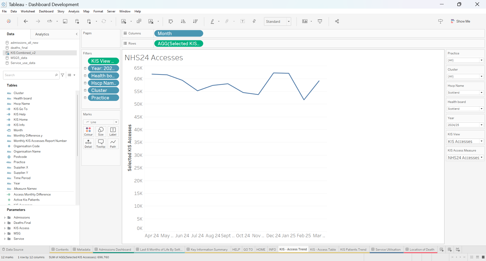
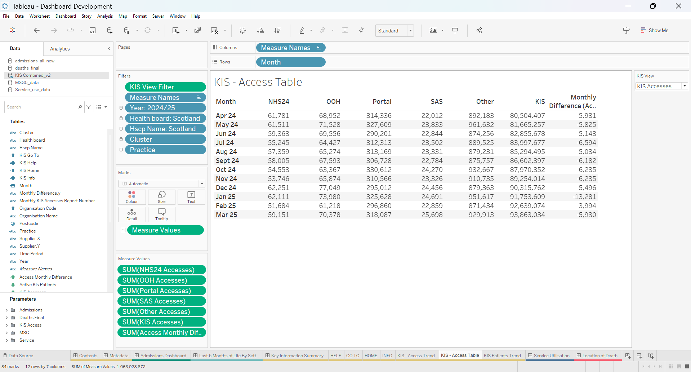
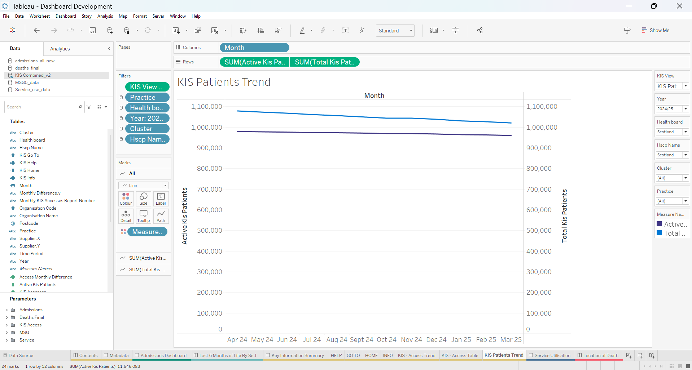
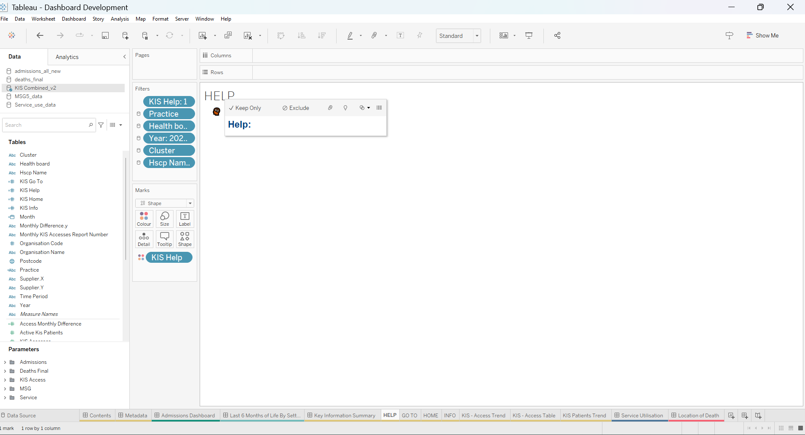
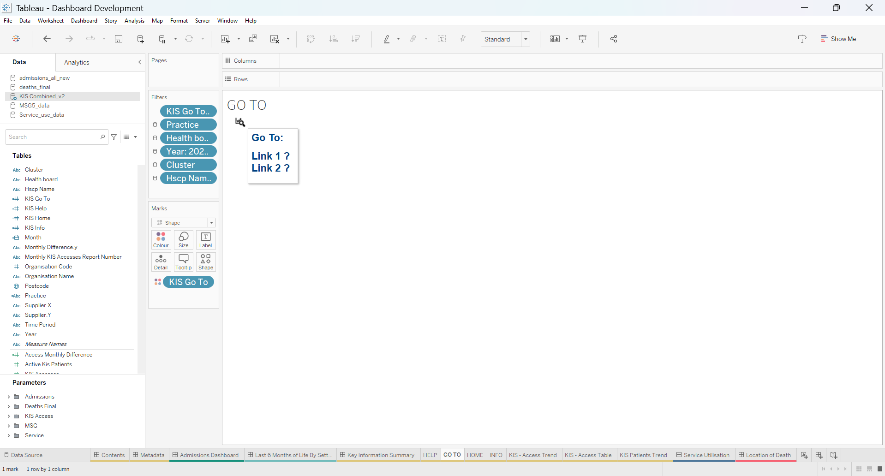
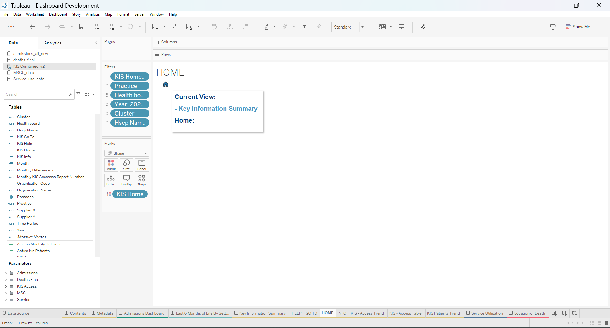
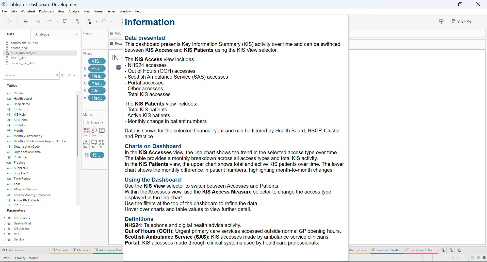

# Key Information Summary — Tableau Worksheets

The supplied workbook evidence confirms **seven KIS-related worksheets**: three analytical worksheets and four shared interface/navigation worksheets.

## Worksheet inventory

| # | Worksheet | Role | Main evidence |
| ---: | --- | --- | --- |
| 1 | **KIS - Access Trend** | Monthly line trend for the selected KIS access channel | `01-KIS-Access-Trend.png` |
| 2 | **KIS - Access Table** | Monthly breakdown across access channels, KIS activity and monthly-difference context | `02-KIS-Access-Table.png` |
| 3 | **KIS Patients Trend** | Monthly comparison of Active KIS Patients and Total KIS Patients | `03-KIS-Patients-Trend.png` |
| 4 | **HELP** | Shared help interaction component | `04-Help.png` |
| 5 | **GO TO** | Shared suite-navigation component | `05-Go-To.png` |
| 6 | **HOME** | Shared home/contents navigation component | `06-Home.png` |
| 7 | **INFO** | KIS-specific definitions and dashboard interpretation guidance | `07-Info.png` |

## 1. KIS - Access Trend



**Reporting role:** show how the selected access channel changes across the months of the selected financial year.

The supplied screenshot shows:

```text
Columns: Month
Rows: AGG(Selected KIS Accesses)
Filters:
  KIS View Filter
  Year
  Health Board
  HSCP
  Cluster
  Practice
Mark: Line
```

The worksheet is controlled by **KIS Access Measure**, so one trend sheet can display NHS24, OOH, Portal, SAS or Other accesses without maintaining five separate worksheets.

This is the main analytical benefit of the `Selected KIS Accesses` calculated field.

## 2. KIS - Access Table



**Reporting role:** provide the monthly numerical detail behind the Accesses dashboard state.

The worksheet uses:

```text
Columns: Measure Names
Rows: Month
Marks: Measure Values
```

The underlying Measure Values evidence includes the main access-channel fields, KIS Accesses and monthly-difference context.

The dashboard intentionally uses shorter **aliases** for some displayed table headings where the full technical field name would make the table unnecessarily cramped. The underlying field names and logic are documented in this case study; the shorter dashboard wording is a presentation choice rather than a different measure.

The same Year / Health Board / HSCP / Cluster / Practice structure is applied, together with `KIS View Filter`.

This table is important because it preserves the wider activity context while the line chart is focused on one selected channel.

## 3. KIS Patients Trend



**Reporting role:** compare the active and total KIS patient populations over time.

The supplied screenshot shows:

```text
Columns: Month
Rows:
  SUM(Active KIS Patients)
  SUM(Total KIS Patients)
Filters:
  KIS View Filter
  Practice
  Health Board
  Year
  Cluster
  HSCP
Mark: Line
```

The worksheet uses two related patient measures in one time-series view. This is a different analytical structure from Accesses and is one reason the combined dashboard uses a view selector rather than forcing both concepts onto the same chart.

## 4–7. Shared interface worksheets

### HELP



A small shape/helper worksheet used to expose help guidance from the KIS dashboard.

### GO TO



A navigation helper used within the wider reporting suite so users can move between analytical dashboard areas.

### HOME



Returns the user to the reporting-suite home/contents context.

### INFO



The Information worksheet contains KIS-specific explanatory content covering the dashboard purpose, Accesses versus Patients, access channels, patient measures, reporting filters and the main interaction controls.

The explanatory wording is part of the managed reporting product and may continue to be refined by the team as the dashboard moves through publication/review. The portfolio retains the supplied screenshot as evidence of the embedded information-design approach rather than treating every line of guidance as immutable technical logic.

## Shared filtering model

The analytical worksheets use a common reporting context built around:

```text
Financial Year
Health Board
HSCP
Cluster
Practice
```

This is important to the combined-dashboard design: users can switch between Accesses and Patients without learning a different geography/filter structure for each view.

## Evidence boundary

The worksheet screenshots are technical configuration evidence. They show the Tableau shelves, filters and field structure required to understand the implementation.

Public analytical results remain restricted to approved **Scotland-level aggregate states**. The repository does not publish local GP/practice outputs simply because the production worksheet supports those filters.
