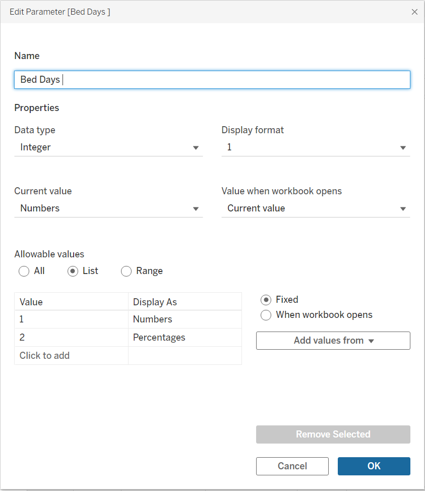

# Last 6 Months of Life by Setting (MSG5) — Technical Case Study

This case study documents the Tableau implementation of the **Last 6 Months of Life by Setting** dashboard within the wider palliative and end-of-life care reporting suite.

The dashboard is based on **MSG Indicator 5 — End of Life** analytical output supplied by another Public Health Scotland team. I did **not** develop or run the upstream MSG production code. My role was to work with the supplied aggregated indicator output and develop the Tableau reporting layer used to present, filter, explain and validate the result.

> **Evidence status: technical case study complete in structure and wording.** The supplied Tableau screenshots now confirm the worksheet architecture, two parameters, four relevant calculated/helper fields, Scotland-level Numbers and Percentages states, navigation components and source-to-display logic. The only remaining repository action is to place the supplied public-safe screenshot files into the evidence folders listed below.

## Case study at a glance

| Employer question | Evidence from this dashboard |
| --- | --- |
| **What problem was being solved?** | A multi-setting end-of-life indicator needed to be presented in an accessible interactive format so users could compare how the final six months of life were distributed across Community, Community Hospital, Large Hospital and Hospice / Specialist Palliative Care Unit settings over time. |
| **What was my role?** | I used the supplied MSG5 aggregate output as the Tableau data source and developed the reporting layer: dashboard composition, the Numbers / Percentages selector, Council Area selection logic, chart and table worksheets, navigation/help components, interpretation guidance and reporting-layer QA. |
| **What technical capability does it show?** | Parameter-driven Tableau design, coordinated worksheet switching, calculated-field/filter logic, Measure Names / Measure Values composition, geography selection, tooltips, dashboard navigation, information design and source-to-dashboard validation. |
| **How were the numbers trusted?** | Tableau Numbers and Percentages views are reconciled to the supplied aggregate output. The workbook uses the supplied bed-day and percentage fields directly, while the methodology provides reasonableness checks such as `Possible bed days = 182.5 × deaths`. |
| **How did stakeholders influence the product?** | The dashboard was developed within the wider reporting-suite review cycle, with presentation, controls, terminology and interpretation guidance refined iteratively. The evidence is intentionally limited to changes that can be supported by the retained workbook and project context rather than inventing a large change history. |
| **Why does the solution matter?** | It converts a detailed indicator output into one reusable view where users can switch between absolute bed-day volumes and proportional distributions, compare financial years and change reporting geography without maintaining separate dashboard pages. |

## Reporting purpose

The dashboard presents the **last six months of life by care setting**, showing how time is distributed across four reporting categories:

- **Community**
- **Community Hospital**
- **Large Hospital**
- **Hospice / Specialist Palliative Care Unit**

The supplied Tableau-ready dataset contains financial-year results from **2020/21 to 2024/25p** across Council Area reporting geographies and a Scotland aggregate.

The dashboard combines a stacked bar chart with a detailed table so the same result can be interpreted visually and numerically.

## Scotland-level dashboard states

The public portfolio uses Scotland-level evidence only.

### Bed Days — Numbers

The Numbers state presents the four setting-level bed-day totals for each financial year.


For **2024/25p**, the supplied Scotland view displays approximately:

- Community: **9,467,029** bed days
- Community Hospital: **166,842** bed days
- Large Hospital: **945,892** bed days
- Hospice / Specialist Palliative Care Unit: **45,571** bed days

### Bed Days — Percentages

The Percentages state presents the same four categories as a proportional distribution of the fixed six-month observation period.


For **2024/25p**, the supplied Scotland view displays approximately:

- Community: **89.1%**
- Community Hospital: **1.6%**
- Large Hospital: **8.9%**
- Hospice / Specialist Palliative Care Unit: **0.4%**

The case study uses these values to evidence the reporting logic and validation process; it does not make causal claims about why care patterns differ between years or areas.

## My contribution and ownership boundary

The upstream MSG Indicator 5 analytical code was supplied and maintained by another PHS team. The source methodology combines linked hospital and death-record data, applies the six-month end-of-life methodology, derives setting-level bed days and produces aggregated indicator output.

I did not author or run that production pipeline and do not present it as my own work.

My contribution is the **Tableau reporting implementation built on the supplied aggregated output**, including:

- connecting the prepared MSG5 dataset to the Tableau workbook;
- designing the dashboard layout and visual hierarchy;
- implementing the **Bed Days** Numbers / Percentages control;
- implementing the **Council Area** parameter and supporting selection logic;
- composing the stacked-bar and detailed-table worksheet pairs;
- coordinating worksheet behaviour through `BedDaysView_Filter`;
- integrating Home, Go To, Help and Information components used across the wider suite;
- configuring tooltips to provide contextual values such as deaths and possible bed days;
- documenting interpretation guidance and caveats;
- checking that Tableau values reconcile to the supplied MSG5 output.

This boundary is important because the portfolio demonstrates professional BI delivery without claiming ownership of shared analytical pipelines.

## Dataset used by Tableau

The supplied Tableau-ready CSV contains **170 aggregated rows and 12 fields**:

- Financial Year
- Council Area
- Community Bed days
- Palliative Bed days
- Community/Hospital Bed days
- Large Hospital Bed days
- Possible Bed days
- % Community
- % Palliative
- % Community/Hospital
- % Large Hospital
- Deaths

The current extract covers **five financial years** and **34 reporting geography values**, including Scotland and the combined Stirling and Clackmannanshire reporting area.

The dataset itself is not published in this repository.

## Indicator methodology at a glance

The supplied upstream methodology defines the final six months of life as a **183-day analytical window**, with an exact six-month maximum represented as **182.5 bed days per death** in the final calculations.

```text
Possible bed days = 182.5 × deaths
```

Community bed days are derived as the residual after identified inpatient/hospice settings are removed:

```text
Community bed days = Possible bed days
                   - Large Hospital bed days
                   - Community Hospital bed days
                   - Hospice / Palliative Care Unit bed days
```

The supplied source output also contains the four percentage measures used directly by the Tableau percentage worksheets.

A fuller explanation is available in [Data Pipeline and Methodology](data-pipeline-and-methodology.md).

## Tableau interaction design

### Bed Days parameter

The main user-facing **Bed Days** parameter is an integer list:

| Stored value | Display value |
| ---: | --- |
| `1` | Numbers |
| `2` | Percentages |

The workbook opens with **Numbers** selected.



The parameter is surfaced to the user as a simple dropdown while `BedDaysView_Filter` carries the selected value into the worksheet-filter architecture.

### Council Area parameter

The **Council Area** parameter is a string list containing **Scotland** and the available Council Area reporting values. The supplied screenshot confirms **Scotland** as the current/default value.


The parameter is supported by two calculated fields that manage selection behaviour and the Scotland national state. See [Calculated Fields](calculated-fields/README.md).

## Dashboard composition

The evidence confirms four analytical worksheets:

1. **MSG - Settings Breakdown (Bar)** — Numbers stacked bar
2. **MSG - Settings Breakdown (Bar) (2)** — Percentages stacked bar
3. **MSG - Bed Days by Setting** — Numbers table
4. **MSG - Bed Days by Setting %** — Percentages table

The dashboard also uses the wider reporting-suite interface components:

- **Discovery home**
- **Discovery Go To**
- **Discovery Help**
- **Discovery Info**

See [Worksheets](worksheets/README.md).

## Calculation architecture

The supplied screenshots confirm four relevant Tableau calculated/helper fields:

- `Council Area`
- `Is Selected Council (Filter)`
- `BedDaysView_Filter`
- `KPI - Community`

The percentage measures `% Community`, `% Community/Hospital`, `% Large Hospital` and `% Palliative` are **source-supplied measures**, not percentage formulas recreated in Tableau. This is confirmed by the percentage worksheets, which use those fields directly in Measure Values.

See [Calculated Fields](calculated-fields/README.md).

## Tooltip and contextual reporting

The bar worksheets include **Possible Bed days** and **Deaths** on the tooltip layer. In the supplied Scotland Percentage view, hovering 2021/22 shows:

- Community: **89.70%**
- Deaths: **58,441**
- Possible Bed days: **10,665,483**

This is consistent with the upstream reasonableness relationship:

```text
58,441 × 182.5 = 10,665,482.5
```

which rounds to **10,665,483** for display.

## Information design

The managed dashboard includes an Information panel explaining:

- what the dashboard presents;
- the four care settings;
- Numbers versus Percentages;
- the financial-year structure;
- Council Area filtering;
- stacked-bar and table interpretation;
- tooltip use;
- the broad linked hospital/death-record basis of the indicator;
- caveats around data completeness, reporting differences and service configuration.

The raw Information-panel screenshot supplied for portfolio review contains an explicit internal management-information distribution warning, so it should **not** be committed to this public repository as-is. The public portfolio therefore documents its analytical content textually rather than redistributing that restricted screenshot.

## Validation approach

The reporting-layer evidence chain is:

```text
Supplied MSG5 aggregate output
        ↓
Tableau source fields
        ↓
Numbers worksheet pair
        ↓
Percentage worksheet pair
        ↓
Council Area + Bed Days controls
        ↓
Stacked bar + table alignment
```

Validation covers:

- source-row reconciliation for selected financial years;
- confirmation that Numbers worksheets use the four supplied bed-day fields;
- confirmation that Percentage worksheets use the four supplied percentage fields;
- percentage totals of approximately 100%, allowing for display rounding;
- Council Area parameter/filter behaviour;
- Bed Days selector behaviour;
- alignment between the chart and table for the active analytical state;
- tooltip reasonableness checks using Deaths and Possible Bed days;
- navigation and information/help behaviour;
- public-governance review before screenshot publication.

See [Validation and Development](validation-and-development.md).

## Evidence structure

- [Dashboard screenshots](dashboard-screenshots/README.md)
- [Worksheets](worksheets/README.md)
- [Parameters](parameters/README.md)
- [Calculated fields](calculated-fields/README.md)
- [Data pipeline and methodology](data-pipeline-and-methodology.md)
- [Tableau implementation](tableau-implementation.md)
- [Validation and development](validation-and-development.md)

Unlike the Admissions Dashboard, MSG5 is a comparatively compact reporting product. The documentation is therefore deliberately proportionate: the same evidence structure is followed, but the case study does not manufacture extra calculations or folders simply to match Admissions by file count.

## Governance and portfolio boundary

The repository does not publish:

- the supplied MSG5 CSV;
- the production R scripts supplied by another team;
- linked record-level data;
- credentials, internal paths or infrastructure details;
- granular dashboard states outside the approved Scotland-level portfolio boundary;
- screenshots carrying explicit internal distribution restrictions.

The public case study focuses on **Tableau implementation, analytical interpretation, validation, information design and appropriate attribution of upstream methodology**.

## Definition of done

The case study is ready for final portfolio review once the supplied public-safe image files are committed to the folders referenced above. At that point, a reviewer can understand:

- what the indicator measures;
- what work was upstream team-owned versus Tableau work completed here;
- how Numbers and Percentages are implemented;
- how Council Area selection is controlled;
- how displayed values trace to the supplied source output;
- the worksheet/control/calculation architecture;
- the interpretation and governance safeguards;
- why the dashboard is useful without access to the managed Tableau environment.
