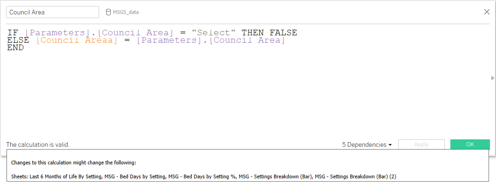
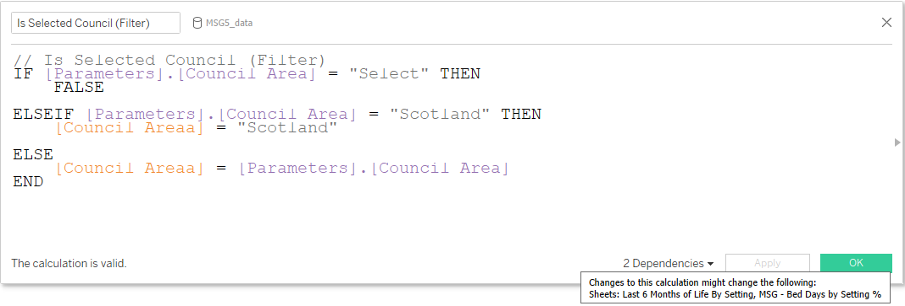
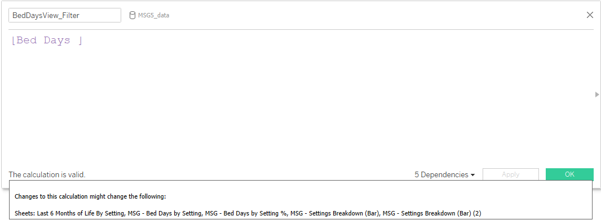
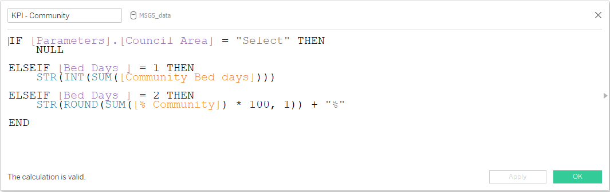

# MSG5 — Calculated Fields

This folder documents the calculated/helper fields that are genuinely relevant to the **Last 6 Months of Life by Setting** dashboard.

Unlike the Admissions Dashboard, MSG5 has a deliberately small Tableau calculation layer. The four main Numbers measures and four Percentage measures are supplied by the governed MSG5 dataset; Tableau calculations are focused on **geography selection, view switching and presentation logic**.

## Architecture at a glance

| Field | Purpose | Main dependency |
| --- | --- | --- |
| `Council Area` | Tests whether the source geography matches the selected Council Area parameter | Council Area parameter + source Council Area field |
| `Is Selected Council (Filter)` | Applies explicit selection logic for `Select`, Scotland and a chosen Council Area | Council Area parameter + source Council Area field |
| `BedDaysView_Filter` | Carries the current Bed Days parameter state into worksheet filters | Bed Days parameter |
| `KPI - Community` | Formats the Community measure as either a whole-number bed-day value or one-decimal percentage | Council Area parameter + Bed Days parameter + Community source measures |

The workbook screenshot shows the source geography field internally as **`Council Areaa`**. This appears to be the existing source-field name and is retained here only when documenting the actual calculation syntax; public-facing dashboard wording remains **Council Area**.

## 1. `Council Area`



### Purpose

Provides a Boolean match between the user-selected Council Area parameter and the source geography field, while protecting the unselected `Select` state.

### Workbook logic

```text
IF [Parameters].[Council Area] = "Select" THEN FALSE
ELSE [Council Areaa] = [Parameters].[Council Area]
END
```

### Why it exists

The dashboard uses a parameter rather than exposing the raw source geography field directly. This calculation converts that user selection into a worksheet-level Boolean filter condition.

## 2. `Is Selected Council (Filter)`



### Purpose

Provides the fuller reporting-geography filter logic, including explicit handling for the Scotland aggregate.

### Workbook logic

```text
// Is Selected Council (Filter)
IF [Parameters].[Council Area] = "Select" THEN
    FALSE
ELSEIF [Parameters].[Council Area] = "Scotland" THEN
    [Council Areaa] = "Scotland"
ELSE
    [Council Areaa] = [Parameters].[Council Area]
END
```

### Why it exists

This allows the same dashboard to work consistently for Scotland and the governed Council Area views while keeping the parameter-driven interface predictable.

The public portfolio uses **Scotland-level results only**, but the calculation demonstrates the reusable managed-workbook architecture.

## 3. `BedDaysView_Filter`



### Purpose

Carries the current **Bed Days** parameter value into the worksheet filter layer.

### Workbook logic

The calculation is a direct reference to the Bed Days parameter:

```text
[Bed Days]
```

### Why it exists

The dashboard uses separate Numbers and Percentages worksheet pairs. The parameter stores:

```text
1 = Numbers
2 = Percentages
```

`BedDaysView_Filter` gives those sheets a lightweight shared field that can be filtered to the appropriate state.

The screenshot shows this field affecting the main dashboard and all four analytical MSG5 worksheets.

## 4. `KPI - Community`



### Purpose

Formats the Community measure according to the active dashboard mode.

### Workbook logic

```text
IF [Parameters].[Council Area] = "Select" THEN
    NULL

ELSEIF [Bed Days] = 1 THEN
    STR(INT(SUM([Community Bed days])))

ELSEIF [Bed Days] = 2 THEN
    STR(ROUND(SUM([% Community]) * 100, 1)) + "%"
END
```

### Behaviour

- when no geography is selected, the field returns `NULL`;
- in **Numbers** mode, Community bed days are formatted as a whole-number text value;
- in **Percentages** mode, `% Community` is multiplied by 100, rounded to one decimal place and formatted with a `%` suffix.

This is a useful example of one calculation responding to both the geography state and the Numbers / Percentages parameter.

## Source measures versus calculated fields

The completed worksheet evidence resolves an earlier uncertainty in the draft case study.

The following are **source-supplied measures**, not Tableau percentage calculations created for the dashboard:

### Bed-day measures

- `Community Bed days`
- `Community/Hospital Bed days`
- `Large Hospital Bed days`
- `Palliative Bed days`
- `Possible Bed days`
- `Deaths`

### Percentage measures

- `% Community`
- `% Community/Hospital`
- `% Large Hospital`
- `% Palliative`

The main Numbers and Percentages chart/table worksheets use these source fields directly in Measure Values.

## Why the calculation layer is deliberately small

MSG5 does not need a large family of bespoke Tableau calculations. Most analytical derivation happens upstream in the governed indicator process. The Tableau layer instead demonstrates:

- parameter-driven interaction;
- geography-selection logic;
- controlled worksheet switching;
- display formatting;
- accurate use of supplied analytical measures.

That is the correct technical story for this dashboard and avoids overstating Tableau complexity simply to match the larger Admissions case study.
