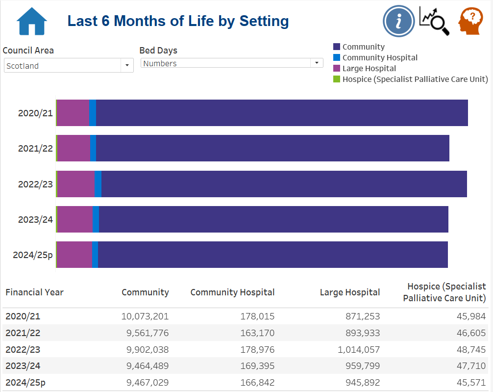
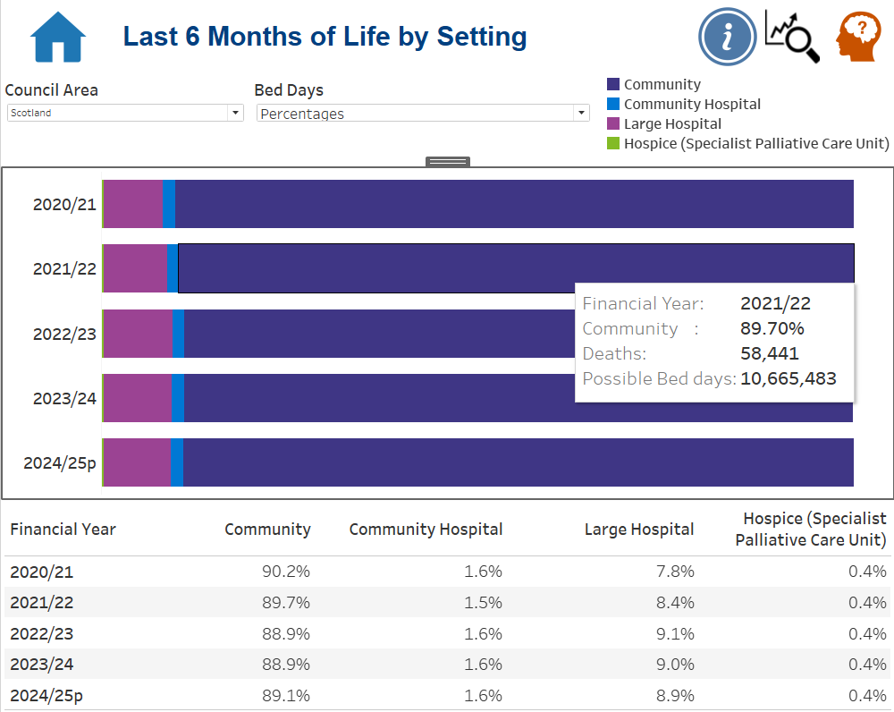

# MSG5 — Dashboard Screenshots

This folder contains the approved public evidence for the **Last 6 Months of Life by Setting** dashboard.

The evidence set is intentionally small: it demonstrates the two main analytical states clearly without uploading every possible Council Area or filter combination.

## Evidence set

| File | Purpose | Status |
| --- | --- | --- |
| `01-L6MOL-Scotland-Level-Dashboard-Overview-Numbers.png` | Final Scotland-level **Numbers** state showing absolute setting-level bed days across 2020/21–2024/25p | Ready to upload |
| `02-L6MOL-Scotland-Level-Dashboard-Overview-Percentages.png` | Final Scotland-level **Percentages** state showing the proportional distribution across the same four settings and years | Ready to upload |

## Numbers view

The Numbers state shows the four setting-level bed-day measures as a stacked bar plus detailed table.

## Percentages view

The Percentages state uses the same dashboard structure while switching to the four supplied percentage measures. The supplied screenshot also demonstrates tooltip context using Financial Year, the active percentage, Deaths and Possible Bed days.

## Information-panel evidence

A Tableau screenshot of the managed **Information** panel was supplied during evidence review. It contains useful guidance about:

- the purpose of the dashboard;
- the four care settings;
- Numbers / Percentages;
- financial years and Council Area selection;
- chart/table interpretation;
- tooltip use;
- linked hospital/death-record context;
- data-completeness and service-configuration caveats.

However, that screenshot also contains an explicit **“Management information only, not for onward distribution”** warning. It is therefore deliberately **not** included in the public screenshot set. Its relevant analytical content is documented textually in the case-study README and Tableau implementation page instead.

## Why there is no Council Area screenshot

The managed workbook supports Council Area reporting, but the public portfolio boundary is **Scotland-level evidence only**. The parameter/filter implementation is demonstrated through technical screenshots without publishing local analytical results.

## Public portfolio rule

Only approved screenshots suitable for public portfolio use should be committed here. Do not expose source files, internal URLs, credentials, local operational details or unnecessary granular combinations.
