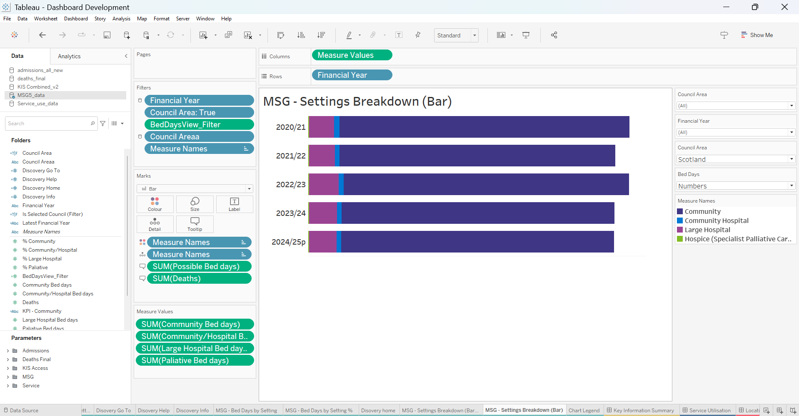
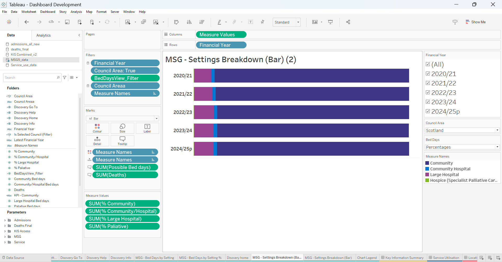
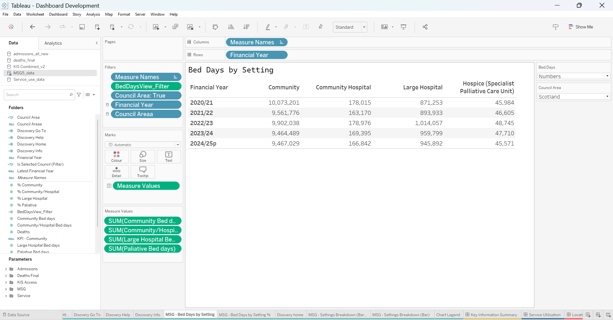
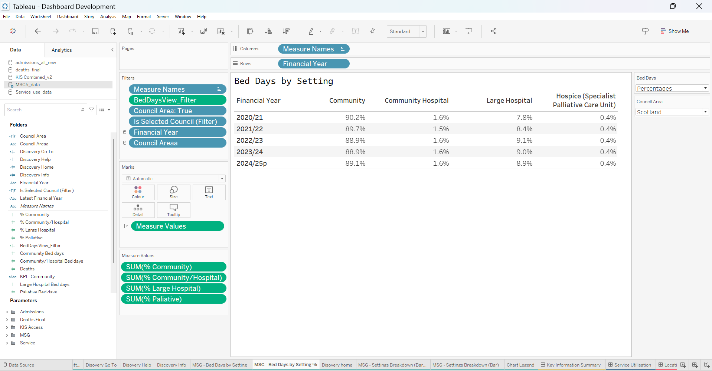

# MSG5 — Tableau Worksheets

This folder documents the worksheets used to assemble the **Last 6 Months of Life by Setting** dashboard.

The completed evidence confirms a compact architecture: four analytical worksheets plus the reporting-suite navigation/help components.

## Analytical worksheets

| Worksheet | Role | Evidence file |
| --- | --- | --- |
| **MSG - Settings Breakdown (Bar)** | Stacked bar for the **Numbers** view using the four supplied bed-day measures | `01-MSG5-Settings-Breakdown-Numbers.png` |
| **MSG - Settings Breakdown (Bar) (2)** | Stacked bar for the **Percentages** view using the four supplied percentage measures | `02-MSG5-Settings-Breakdown-Percentages.png` |
| **MSG - Bed Days by Setting** | Detailed table for absolute bed-day values | `03-MSG5-Settings-Table-Numbers.png` |
| **MSG - Bed Days by Setting %** | Detailed table for percentage distribution | `04-MSG5-Settings-Table-Percentages.png` |

### Numbers stacked bar



The screenshot shows:

- **Columns:** Measure Values
- **Rows:** Financial Year
- filters including Financial Year, Council Area selection, `BedDaysView_Filter` and Measure Names;
- Measure Values populated with Community, Community Hospital, Large Hospital and Palliative bed-day fields;
- Measure Names used for colour/setting separation;
- Possible Bed days and Deaths on the tooltip/detail layer.

### Percentages stacked bar



This worksheet uses the supplied `% Community`, `% Community/Hospital`, `% Large Hospital` and `% Palliative` fields directly. This is important evidence that the main percentage display does not recreate the upstream percentages in Tableau.

### Numbers table



The table uses Financial Year on rows, Measure Names on columns and Measure Values as text so the same four setting totals can be read numerically.

### Percentages table



The percentage table mirrors the same architecture with the four supplied percentage fields.

## Shared interface worksheets

The dashboard also uses the shared reporting-suite components:

- `Discovery home`
- `Discovery Go To`
- `Discovery Help`
- `Discovery Info`

The supplied technical evidence includes:

| File | Evidence |
| --- | --- |
| `05-home-icon.png` | Home navigation worksheet and tooltip behaviour |
| `07-help-icon.png` | Help worksheet / help icon implementation |
| `08-go-to-icon.png` | Go To worksheet / navigation-link implementation |

The raw `Discovery Info` screenshot is **not** intended for public upload because the panel itself contains an explicit internal distribution warning. Its interpretation content is instead documented in the main case study and Tableau implementation README.

## Why this worksheet structure works

The architecture deliberately separates Numbers and Percentages at worksheet level while presenting them as one dashboard-level interaction:

```text
Bed Days parameter
      ↓
BedDaysView_Filter
      ↓
Numbers worksheet pair
        OR
Percentages worksheet pair
```

This keeps formatting and measure selection straightforward while giving users one consistent reporting experience.

## Evidence rule

The purpose of these screenshots is to prove the implementation, not to publish the full managed workbook. Public evidence remains Scotland-level and excludes source data, workbooks/extracts, internal paths, credentials and restricted dashboard content.
